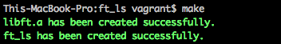
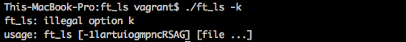

# ft_ls:

The ls command is one of the first commands you have learned to use with shell, It is also one you are using the most, Perhaps you have already asked yourself how is this function coded? Thanks to this project, you will soon find out.

To Recode ls and some of its options will allow you to find out how to interact with the file system using C, After all, you already know how to open, read, write and close a file. But, what about the directories? Special files? Rights, dates or sizes of the files?

## Implementation infos
- I used **Binary tree** for that in the speed test ft_ls is fast as ls

## Compile
- Run `make`

## Usage
- Execute `./ft_ls [-options] <arguments>`

I made a lot of options for the bonus
- **l** : display in long format - show permissions
- **a** : include hidden files
- **r** : reverse order
- **t** : sort by time & date
- **i** : display file's inode index number alomg with file names
- **o** : display only the user ID of owner
- **g** : display only the group ID numbers
- **m** : display names in single line and separate names with **,**  
- **n** : display user ID & group IDs as numbers instead of names
- **p** : puts **/** after directory names
- **u** : sort by last access time & display in long format
- **R** : list recursively directory tree
- **S** : list sort by file size
- **A** : list same as **a** but exclude **.** and **..**
- **G** : use colors in display

## Show Test
Same as the original **ls**

## Owners
- Oussama Belouche 1337
- Ilyas Shaimoun 1337

